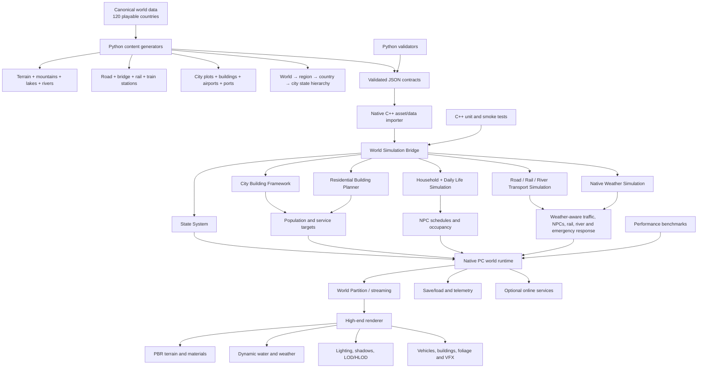
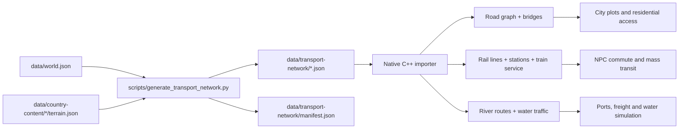

# Indoru World — Native PC Architecture Workflow and Implementation Roadmap

## Product direction

The canonical target is a **native high-end PC game** for desktop/laptop hardware. The existing Babylon.js project remains a fast data/debug viewer, not the final game runtime. The production renderer can be Unreal Engine 5 or another native C++ renderer, while the simulation/data contracts remain engine-agnostic.

## Complete architecture workflow



## Layer responsibilities

### 1. Canonical data layer

- `data/world.json` and `data/countries.json` remain the identity source of truth.
- All 120 countries are playable.
- Country IDs, map keys, flags and starter identity are stable save-game identifiers.

### 2. Procedural generation layer

- `scripts/generate_country_templates.py` generates heightfields and geography features.
- `scripts/generate_transport_network.py` converts geography into production transport contracts.
- Every generated object receives a stable ID and source country ID.
- Generated output is reviewable data, not a claim that final AAA meshes already exist.

### 3. Native simulation layer

The C++ engine consumes validated contracts and produces simulation plans:

- `CityBuildingFramework`: zones, roads, plots and utility targets.
- `ResidentialBuildingPlanner`: residential units, buildings and placement cells.
- `ResidentialSimulation`: household capacity, occupancy and schedules.
- `WorldSimulationBridge`: maps country transport links into city/residential simulation plans.
- `StateSystem`: validates world/region/country/city/settlement hierarchy and applies overflow-safe population transitions.
- `WeatherSimulation`: samples deterministic 15-minute weather states and applies bounded effects to grip, visibility, NPC activity, rail service, river navigation and emergency response.

### 4. Native PC runtime

The final runtime should load the C++ simulation library directly. A native renderer consumes the same stable IDs and transforms:

- World streaming and HLOD.
- PBR terrain and buildings.
- Train, road vehicle and river traffic systems.
- NPC population tiers.
- Weather, lighting, water and VFX.

The current Babylon client can visualize contracts during development, but it is not the final high-end PC runtime.

## Transport data workflow



## Generated transport contract

Each country package contains:

- Road segments with class, lanes, speed limit, access flags and polyline points.
- Bridges connected to a road and river ID.
- Intercity rail lines with gauge, speed and electrification profile.
- Stations for capital and generated settlements.
- Rivers with navigability and water-transport mode.
- Simulation hooks for city infrastructure, residential access, traffic, mass transit and water traffic.

## Implementation roadmap

### Phase 0 — Completed foundation

- Canonical 120-country registry.
- Deterministic terrain and geography generation.
- Babylon PBR terrain, water shader and lighting prototype.
- C++ physics engine with terrain-aware suspension and gravity/load transfer.
- Uploaded P1 city, residential and household modules integrated.
- Native `WorldSimulationBridge` added.
- C++ test suite expanded to 10 passing tests.

### Phase 1 — Data and importer hardening

1. Add formal JSON Schema for `transport-network/*.json`.
2. Add formal JSON Schema for `state-system/*.json`.
3. Add a native C++ importer that parses transport and state packages into typed graphs.
4. Reject missing country IDs, broken road/bridge/river references and disconnected rail stations.
5. Add deterministic hash/version fields for save compatibility.
6. Add CI jobs for Python generation, all validators and C++ tests.

### Phase 2 — Native PC vertical slice

1. Create a native desktop target around the C++ engine.
2. Load one country package at startup.
3. Stream terrain, roads, rail and river data by world cell.
4. Spawn one city with residential building targets.
5. Spawn household schedules and connect NPC destinations to roads/stations.
6. Add one drivable vehicle, one train and one river vessel.
7. Measure CPU, GPU, memory and streaming latency on a high-end PC.

### Phase 3 — Production rendering

1. Replace placeholder geometry with authored PBR building/terrain assets.
2. Add texture streaming, virtual shadow maps, HLOD and hierarchical instancing.
3. Add high-quality water reflections, shore foam, underwater fog and river current.
4. Add volumetric atmosphere, weather, day/night lighting and reflection captures.
5. Add foliage scattering, LOD rules and occlusion culling.
6. Profile shader permutations and GPU memory budgets.

### Phase 4 — Simulation scale

1. Convert city targets into streamed building entities.
2. Add Mass-style population tiers: near, mid, far and aggregate.
3. Connect household schedules to work, school, commerce, nightlife and emergency services.
4. Add traffic graph routing for roads, trains and rivers.
5. Add service coverage and city growth simulation.
6. Add save/load for simulation state and deterministic replay tests.

### Phase 5 — 120-country production

1. Run the generator and validation pipeline for all countries.
2. Assign authored regional art direction and biome kits.
3. Add country-specific transport, architecture and weather profiles.
4. Build world streaming partitions and country transition rules.
5. Validate memory, loading time and frame-time budgets across representative countries.
6. Package native PC builds and automated content patches.

## Native PC performance gates

Before calling a country production-ready, measure:

- 60 FPS target at the agreed high-end resolution and quality preset.
- Separate CPU/GPU frame budgets.
- Streaming hitch time and peak memory.
- Number of active near-field NPCs, vehicles and physics bodies.
- Shadow, water and volumetric effect costs.
- Save/load duration and deterministic replay consistency.

## Current implementation commands

```bash
# Generate country terrain/content
python3 scripts/generate_country_templates.py --force

# Generate road, train and river contracts for all 120 countries
python3 scripts/generate_transport_network.py --force

# Validate canonical world data
python3 scripts/validate_world_data.py

# Build and run native C++ tests
cmake -S engine/cpp -B build -DCMAKE_BUILD_TYPE=Debug
cmake --build build --parallel 2
ctest --test-dir build --output-on-failure
```
